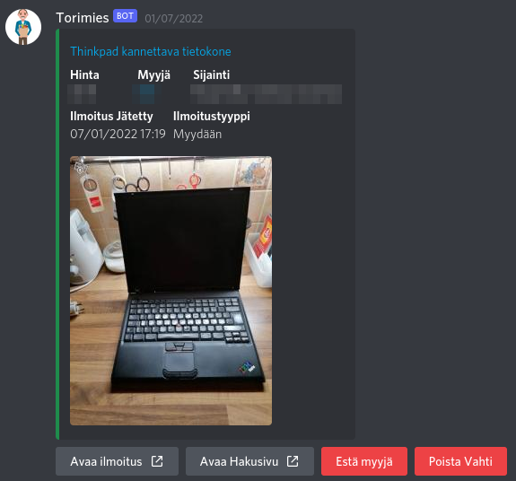

# torimies-rs

## How the bot works

Users of the bot can create and remove vahti-entries that they have made. Vahti-entries are stored in the sqlite-database of the bot.
The vahtis in the database are periodically checked for new matches on the tori.fi site using an undocumented api endpoint, and new matching listings are then sent to the vahti's creator.

## Features
Available features-flags are
* "tori"
* "huutonet"
* "discord" (both "discord-command" and "discord-delivery")
* "discord-delivery"
* "discord-command"
* "telegram" (both "telegram-command" and "telegram-delivery")
* "telegram-delivery"
* "telegram-command"

Default features include all the features.
Configure your instance according to your needs with `cargo build --release --no-default-features --features LIST,OF,FEATURES`
Please not that the program does not compile if no site-support is configures (atleast one of features "tori" and "huutonet")

## Hosting the bot
### Discord:
If you do not have a discord application ready create one [here](https://discord.com/developers/applications). Create a bot user for the application if one doesn't already exist.

When you have your discord application ready, visit the following link to generate an invite link: `https://discord.com/developers/applications/YourAppID/oauth2/url-generator`.
Replace "YourAppID" with the application id of your application.

The discord application invite link used should have the following scopes:
 - `bot` - required for the invite link to be a bot-invite link
 - `applications.commands` - required for the bot commands to be usable

Make sure to create the `.env` file if it does not exist and ensure that it contains all the necessary variables:
* `DATABASE_URL=database.sqlite` (or another location)
* `DISCORD_TOKEN=YourToken` (the token for your discord bot)
* `APPLICATION_ID=YourAppID` (the discord application id)

Optional variables:
* `UPDATE_INTERVAL=time_in_seconds` (the interval at which the bot updates vahtis, defaults to 60)
* `FUTURES_MAX_BUFFER_SIZE=integer` (the argument given to [buffer\_unordered](https://docs.rs/futures/0.3.28/futures/prelude/stream/trait.StreamExt.html#method.buffer_unordered) defining the amount of concurrent futures. Recommended amount is ~6\*`$(nproc)` and a larger amount may cause problems, defaults to 10)

### Telegram:
Create a bot with [@BotFather](https://t.me/botfather)
set `TELOXIDE_TOKEN` value to the API-token.

Make sure to create the `.env` file if it does not exist and ensure that it contains all the necessary variables:
* `DATABASE_URL=database.sqlite` (or another location)
* `TELOXIDE_TOKEN=YourToken` (the token for your telegram bot)

Optional variables:
* `UPDATE_INTERVAL=time_in_seconds` (the interval at which the bot updates vahtis, defaults to 60)
* `FUTURES_MAX_BUFFER_SIZE=integer` (the argument given to [buffer\_unordered](https://docs.rs/futures/0.3.28/futures/prelude/stream/trait.StreamExt.html#method.buffer_unordered) defining the amount of concurrent futures. Recommended amount is `50`, raising it above that will most likely bring diminishing returns. Default value is 50)

### With Docker

Bot can be started by running command `docker-compose up -d`.

Log viewing happens with command `docker-compose logs`.

`docker-compose up -d --build` rebuilds the Docker image and restarts the container with the new image.

Bot can be shut down with command `docker-compose down`.

### Without Docker

Before starting the bot you must setup the sqlite-database. This can be done with the `diesel` tool, which is used in these instructions.

`diesel` can be installed using `cargo install diesel_cli`.

After installing the `diesel` tool the `reset_db.sh` script can be run
to automatically set up the database, deleting any existing database.

The binary builds include a pre-initialized database.

### Autodeploy

Use watchtower to pull automatically the latest image.

#### For databases setup before diesel-migration

If you have a database with pre-existing data, the `diesel` tool wont be able to apply the migrations.

In order to run the migrations I've written a simple script that temporarily gets rid of the `initial_migration`
and then runs the migrations.

**Please remember to change the `DATABASE_URL` to `database.sqlite` instead of `sqlite:database.sqlite` :)**

Then see `sqlx_migrate.sh`

### Running torimies-rs

**If you are building from source** run `cargo run --release` in the root of the repository.

**If you are are using a binary build** run `./torimies-rs`.

## Using the bot

The bot has two main commands implemented as application commands (slash-commands)
and those are:
* `/vahti url` Adds a new vahti with the specified url
* `/poistavahti url` Removes the vahti with the specified url
* `/poistaesto` Prompts you with a drop-down menu to select which seller you wish to unblock

One additional owner-restricted commmand is also included (this is not a slash-command):
* `!update_all_vahtis` immediately updates all vahtis

Please keep in mind that the bot is still considered to be WIP.
We will gladly accept any feedback/feature requests :), just file an [issue](https://github.com/Testausserveri/torimies-rs/issues) and we'll look into it.
